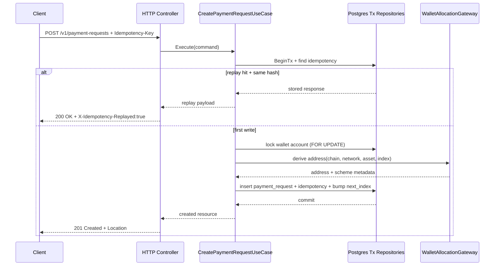

# Technical Design

## High-level approach

- Summary: Introduce a `Payment Request` aggregate in application/domain layers, backed by PostgreSQL transactional allocation and REST endpoints under `/v1`.
- Key decisions:
  - Model "generate address" as `POST /v1/payment-requests` resource creation.
  - Keep one request schema and one `payment_instructions` envelope for BTC/ETH/USDT.
  - Use server-controlled asset catalog for chain/asset metadata (decimals, token contract, address scheme) and wallet-account mapping.
  - Decouple wallet allocation cursor from asset so ETH/USDT on the same EVM network can share one address allocator safely.
  - Make idempotency first-class with deterministic request hashing (RFC 8785 JCS + SHA-256), scoped by principal + endpoint, and stored replay response.
  - Canonicalize addresses per chain rules: EVM lowercase for storage + EIP-55 in response; Bitcoin bech32 lowercase; Bitcoin base58 stored as-is after base58check validation.
  - Enforce expiry bounds at API boundary: `expires_in_seconds` in `[60, 2592000]` with resolved non-null `expires_at`.
  - Run startup integrity checks for enabled asset-to-wallet mappings before serving traffic.
  - Allocate derivation index and persist request atomically within one DB transaction.

## System context

- Components:
  - `internal/adapters/inbound/http/controllers`: request validation, error mapping, HTTP response shaping.
  - `internal/application/ports/in`: use cases for `CreatePaymentRequest`, `GetPaymentRequest`, `ListAssets`.
  - `internal/application/ports/out`: repository/idempotency/wallet allocation contracts.
  - `internal/application/use_cases`: orchestration for validation, idempotency lookup, transactional allocation.
  - `internal/domain`: value objects for chain/network/asset enums, minor units, payment request status.
  - `internal/adapters/outbound/persistence/postgresql`: transactional repositories and query models.
  - `internal/bootstrap/di`: wiring for new use cases/adapters.
  - auth/middleware boundary: provides authenticated principal identifier used in idempotency scope.
- Interfaces:
  - Inbound ports:
    - `CreatePaymentRequestUseCase.Execute(ctx, command)`
    - `GetPaymentRequestUseCase.Execute(ctx, query)`
    - `ListAssetsUseCase.Execute(ctx)`
  - Outbound ports:
    - `AssetCatalogReadModel`
    - `PaymentRequestRepository`
    - `IdempotencyRepository`
    - `WalletAllocationGateway`

## Key flows

- Flow 1: `GET /v1/assets`

  - Controller calls `ListAssetsUseCase`.
  - Use case returns catalog entries filtered by enabled state.
  - Controller maps to response DTO.

- Flow 2: `POST /v1/payment-requests` first submission

  - Validate request body and idempotency header format.
  - Validate `expires_in_seconds` range (`60..2592000`) and `expected_amount_minor` format (`^[0-9]{1,78}$`) when provided.
  - Resolve `(chain, network, asset)` in asset catalog, including mapped `wallet_account_id`.
  - Build idempotency scope from `(principal_id, method, normalized_path)`.
  - Begin DB transaction.
  - Check idempotency table by scope + key.
  - If miss:
    - Lock mapped wallet account row `FOR UPDATE`.
    - Read and consume `next_index`.
    - Derive address via wallet allocation adapter.
    - Canonicalize derived address for storage/uniqueness checks.
    - Insert payment request row + instruction details.
    - Persist idempotency record with canonical request hash and response payload snapshot.
    - Increment wallet account `next_index`.
  - Commit and return `201 Created`.

- Flow 3: `POST /v1/payment-requests` retry with same key

  - Lookup idempotency record.
  - Compare canonical request hash.
  - If hash match: return stored resource payload as replay with `200 OK` and `X-Idempotency-Replayed: true`.
  - If hash mismatch: return `409 idempotency_key_conflict`.

- Flow 4: `GET /v1/payment-requests/{id}`
  - Fetch by id from query model.
  - Return canonical representation or `404 payment_request_not_found`.

## Diagrams (optional)

- Mermaid sequence / flow:



## Data model

- Entities:

  - `asset_catalog`
    - purpose: source-of-truth of supported assets and instruction metadata.
    - key columns: `chain`, `network`, `asset`, `wallet_account_id`, `token_standard`, `token_contract`, `token_decimals`, `decimals`, `minor_unit`, `chain_id`, `address_scheme`, `default_expires_in_seconds`, `enabled`.
    - provenance columns (for contract-governed assets): `source_ref`, `approved_by`, `approved_at`.
    - integrity rule: each enabled row must reference an active wallet account, have compatible allocator configuration (for example EVM `address_scheme` + `chain_id` consistency), and keep `default_expires_in_seconds` within `[60, 2592000]`.
  - `wallet_accounts`
    - purpose: per keyset allocation cursor (not asset-specific).
    - key columns: `id`, `chain`, `network`, `keyset_id`, `derivation_path_template`, `next_index`, `is_active`.
    - uniqueness: `(chain, network, keyset_id)` unique.
    - mapping rule: multiple `(chain, network, asset)` rows can point to the same `wallet_account_id`.
  - `payment_requests`
    - key columns:
      - `id` (text, prefix `pr_`)
      - `wallet_account_id`
      - `chain`, `network`, `asset`
      - `status`
      - `expected_amount_minor NUMERIC(78,0) NULL`
      - `address_canonical`, `address_scheme`, `derivation_index`
      - `chain_id NULL`, `token_standard NULL`, `token_contract NULL`, `token_decimals NULL`
      - `metadata JSONB`
      - `expires_at NOT NULL`, `created_at`, `updated_at`
    - uniqueness:
      - `(wallet_account_id, derivation_index)`
      - `(chain, network, address_canonical)`
  - `idempotency_records`
    - key columns: `scope_principal`, `scope_method`, `scope_path`, `idempotency_key`, `request_hash`, `resource_id`, `response_payload JSONB`, `hash_algorithm`, `created_at`, `expires_at`.
    - uniqueness: `(scope_principal, scope_method, scope_path, idempotency_key)`.

- Schema changes or migrations:

  - Add tables/indexes listed above with explicit unique constraints.
  - Add check constraints:
    - `payment_requests.expires_at IS NOT NULL`
    - `payment_requests.expires_at > payment_requests.created_at`
    - `payment_requests.expires_at >= payment_requests.created_at + interval '60 seconds'`
    - `payment_requests.expires_at <= payment_requests.created_at + interval '30 days'`
    - `payment_requests.status <> ''`
    - `payment_requests.expected_amount_minor IS NULL OR payment_requests.expected_amount_minor >= 0`
    - `octet_length(payment_requests.metadata::text) <= 4096`
    - `idempotency_records.expires_at >= idempotency_records.created_at + interval '24 hours'` (minimum retention only).

- Consistency and idempotency:
  - Create flow runs in one transaction.
  - Wallet account row lock prevents concurrent consumers from reading same `next_index`.
  - ETH and USDT on Ethereum can share one wallet account cursor through `asset_catalog.wallet_account_id`, preventing cross-asset address collisions.
  - Address canonicalization for uniqueness:
    - EVM: lowercase `0x`-hex in `address_canonical`, EIP-55 checksum for response.
    - Bitcoin bech32: lowercase in `address_canonical`.
    - Bitcoin base58: original input stored as-is in `address_canonical` after base58check validation.
  - Idempotency lookup/insert happens in same transaction boundary as resource creation.
  - Application computes idempotency expiry as `max(created_at + 7d baseline, request.expires_at, created_at + 24h)`; DB constraint only enforces the 24h minimum.
  - Request hash is calculated from RFC 8785-canonicalized JSON bytes using SHA-256.
  - `expected_amount_minor` request validation is strict (`^[0-9]{1,78}$`), persisted as `NUMERIC(78,0)`, and serialized back to JSON as string.
  - API amount fields are persisted as integer numeric but serialized back to JSON strings to avoid precision loss.
  - If unique conflict occurs (unexpected duplicate due race/retry), transaction retries with bounded attempts and structured error.

## API or contracts

- Endpoints or events:

  - `GET /v1/assets`
  - `POST /v1/payment-requests`
  - `GET /v1/payment-requests/{id}`

- Request/response examples:

`GET /v1/assets` (excerpt):

```json
{
  "assets": [
    {
      "chain": "bitcoin",
      "network": "mainnet",
      "asset": "BTC",
      "minor_unit": "sats",
      "decimals": 8,
      "address_scheme": "bip84_p2wpkh",
      "default_expires_in_seconds": 3600
    },
    {
      "chain": "ethereum",
      "network": "mainnet",
      "asset": "USDT",
      "minor_unit": "token_minor",
      "decimals": 6,
      "token_standard": "ERC20",
      "token_contract": "0x...",
      "token_decimals": 6,
      "address_scheme": "evm_bip44",
      "chain_id": 1,
      "default_expires_in_seconds": 3600
    }
  ]
}
```

`POST /v1/payment-requests` request:

```json
{
  "chain": "bitcoin",
  "network": "mainnet",
  "asset": "BTC",
  "expected_amount_minor": "150000",
  "expires_in_seconds": 3600,
  "metadata": {
    "order_id": "A123"
  }
}
```

Validation notes:

- `expected_amount_minor` is optional; when present it must match `^[0-9]{1,78}$`.
- `expires_in_seconds` when present must be in `[60, 2592000]`.
- `expires_at` is always resolved and non-null in responses.

`POST /v1/payment-requests` first-write response (`201 Created`):

```json
{
  "id": "pr_01J0...",
  "status": "pending",
  "chain": "bitcoin",
  "network": "mainnet",
  "asset": "BTC",
  "expected_amount_minor": "150000",
  "expires_at": "2026-02-09T11:30:00Z",
  "created_at": "2026-02-09T10:30:00Z",
  "payment_instructions": {
    "address": "bc1q...",
    "address_scheme": "bip84_p2wpkh",
    "derivation_index": 42
  }
}
```

`POST /v1/payment-requests` replay response (`200 OK`, `X-Idempotency-Replayed: true`):

```json
{
  "id": "pr_01J0...",
  "status": "pending",
  "chain": "bitcoin",
  "network": "mainnet",
  "asset": "BTC",
  "expected_amount_minor": "150000",
  "expires_at": "2026-02-09T11:30:00Z",
  "created_at": "2026-02-09T10:30:00Z",
  "payment_instructions": {
    "address": "bc1q...",
    "address_scheme": "bip84_p2wpkh",
    "derivation_index": 42
  }
}
```

```json
{
  "error": {
    "code": "idempotency_key_conflict",
    "message": "Idempotency key reused with different request payload",
    "details": {
      "idempotency_key": "abc-123"
    }
  }
}
```

## Backward compatibility (optional)

- API compatibility:
  - Existing endpoints (`/healthz`, `/swagger`) remain unchanged.
  - New payment APIs are additive under `/v1`.
- Data migration compatibility:
  - New tables are additive; no destructive change to existing bootstrap schema.

## Failure modes and resiliency

- Retries/timeouts:
  - Use bounded DB transaction retry when conflict occurs (for example max 3 retries).
  - Wallet address derivation call uses context timeout from HTTP request deadline.
- Backpressure/limits:
  - Enforce payload size bounds (`metadata` <= 4KB).
  - Apply request rate limit at gateway layer (implementation detail outside this spec, but endpoint must be safe when rate limiter exists).
- Degradation strategy:
  - If asset catalog entry is disabled/missing, reject with 400 and no allocation attempt.
  - If catalog-to-wallet mapping is missing or references inactive wallet account, reject with internal configuration error and no allocation attempt.
  - If wallet adapter unavailable, return internal error and avoid partial writes.

## Observability

- Logs:
  - Structured fields: `request_id`, `principal_id`, `payment_request_id`, `chain`, `network`, `asset`, `wallet_account_id`, `derivation_index`, `idempotency_key`, `replayed`.
  - Errors include stable `error.code` and operation phase (`validate`, `allocate`, `persist`, `idempotency`).
- Metrics:
  - `payment_request_create_total{result=success|validation_error|conflict|internal_error}`
  - `payment_request_idempotency_replay_total`
  - `payment_request_allocation_latency_ms` histogram
  - `payment_request_assets_query_latency_ms` histogram
- Traces:
  - Add spans for `idempotency_lookup`, `wallet_allocation`, `db_tx_commit` when tracing is enabled.
- Alerts:
  - Alert candidates for sustained internal error rate and unique-conflict retry exhaustion.

## Security

- Authentication/authorization:
  - API authN/authZ policy is out of scope; endpoints are designed to work behind existing auth middleware.
- Secrets:
  - Wallet secret/xprv must remain outside app database and code repository.
  - Only non-secret metadata (address, derivation index) is persisted in `payment_requests`.
- Abuse cases:
  - Idempotency key replay attack: scope idempotency by authenticated principal + endpoint.
  - Oversized metadata abuse: reject >4KB metadata with validation error.
  - Invalid address injection: server derives address; caller cannot submit destination address.

## Alternatives considered

- Option A: Separate endpoints by asset (`/btc/payment-requests`, `/eth/payment-requests`).
- Option B: Action endpoint (`POST /v1/generate-address`) without persistent resource.
- Option C: Unified `Payment Request` resource + polymorphic instructions (chosen).
- Why chosen: Option C best supports extensibility, reconciliation, and future monitoring/webhook linkage while keeping REST semantics clear.

## Risks

- Risk: Token metadata can drift from actual on-chain contract if asset catalog governance is weak.
- Mitigation: Require explicit approval workflow and auditable source for catalog updates before enabling in production.
- Risk: Allocation throughput bottleneck on single wallet-account row lock at high write load.
- Mitigation: Start with strict consistency; later shard by wallet account pool per asset if throughput requires.
- Risk: Misconfigured asset-to-wallet mapping can route an asset tuple to the wrong allocation cursor.
- Mitigation: Enforce FK constraints, migration-time integrity checks, and startup validation for active mappings.
- Risk: EVM checksum rendering drift across libraries can cause inconsistent API outputs.
- Mitigation: Standardize one checksum implementation and verify with deterministic fixture tests.
