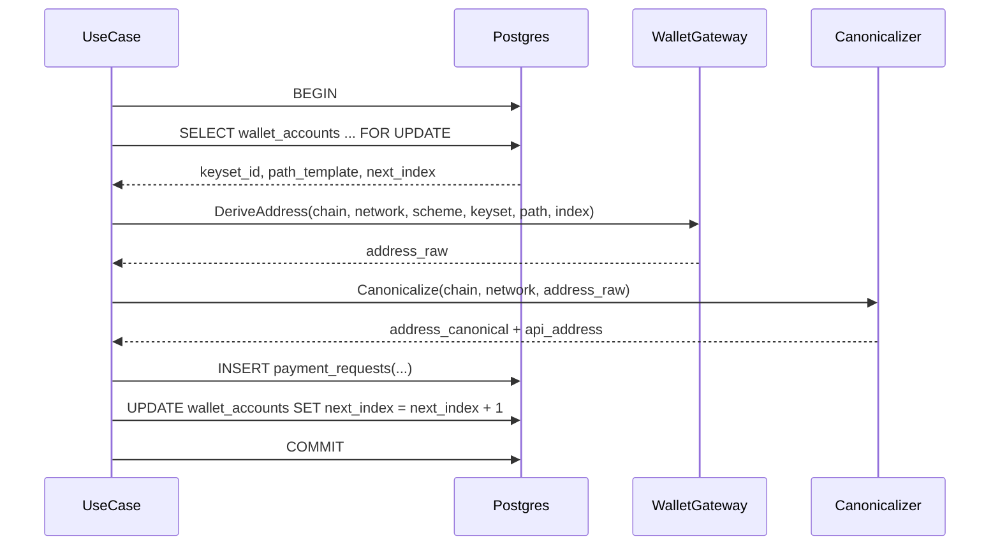

# Technical Design

## High-level approach

- Summary: Implement allocator foundations first: database source-of-truth (`wallet_accounts`, `asset_catalog`), startup validation gate, deterministic dev/test derivation adapter, and transactional cursor consumption in payment-request create flow.
- Key decisions:
  - Keep asset metadata and wallet mapping in DB catalog rather than hardcoded config.
  - Use one allocator cursor per wallet account, allowing cross-asset sharing (ETH/USDT on same EVM network).
  - Abstract derivation via `WalletAllocationGateway` with runtime mode (`devtest` now, `prod` placeholder).
  - Keep DB identities (`wallet_account_id`) out of adapter input; use derivation-ready inputs (`keyset_id`, path template, index).
  - Use 64-bit derivation index (`int64`, non-negative) across application and adapter to align with DB `BIGINT`.
  - Fix keyset depth policy at account level and use deterministic suffix policy: `derivation_path_template` is suffix-only and must be exactly `0/{index}` for this feature.
  - Treat suffix as non-hardened only; hardened segments are disallowed.
  - In dev/test mode, fixed network scope is BTC `regtest`/`testnet` and EVM `sepolia`.
  - Block dev/test mainnet allocations by default unless explicit override flag is set.
  - Keep chain-to-`address_scheme` allow-list in one centralized validation ruleset (bootstrap config), not scattered across adapters/controllers.
  - Fail startup when key parsing/normalization is unsafe or unsupported (`invalid_key_material_format`), with no silent fallback.
  - Canonicalization responsibility belongs to application layer, not wallet adapter.
  - Perform derivation and cursor increment inside one DB transaction, guarded by row lock.

## System context

- Components:
  - `internal/adapters/outbound/persistence/postgresql`:
    - migrations for `wallet_accounts` and `asset_catalog`
    - startup validator read-model queries
    - transactional cursor repository methods
  - `internal/application/ports/out`:
    - `WalletAllocationGateway`
    - catalog/allocator repository contracts
  - `internal/application/services`:
    - `AddressCanonicalizer` (chain-specific canonical and response formatting)
  - `internal/application/use_cases`:
    - create-flow orchestration that consumes cursor and persists request atomically
  - `internal/bootstrap`:
    - adapter mode/config loading
    - startup catalog validation execution
  - `internal/adapters/outbound/wallet`:
    - `devtest` derivation implementation
    - `prod` placeholder implementation
- Interfaces:

```go
// application/ports/out
// DeriveAddress uses derivation-ready parameters and never mutates cursor state.
type WalletAllocationGateway interface {
    DeriveAddress(ctx context.Context, in DeriveAddressInput) (DerivedAddress, error)
}

type DeriveAddressInput struct {
    Chain                  string
    Network                string
    AddressScheme          string
    KeysetID               string
    DerivationPathTemplate string // exact suffix "0/{index}" in this feature; no hardened segment
    DerivationIndex        int64 // must be >= 0
}

type DerivedAddress struct {
    AddressRaw   string // adapter-derived address before app-level canonicalization
    AddressScheme string
    ChainID      *int64
}
```

## Key flows

- Flow 1: Startup validation

  - Load enabled `asset_catalog` rows.
  - Validate `wallet_account_id` existence + active status.
  - Validate chain/network compatibility, `default_expires_in_seconds` bounds, and EVM `chain_id` requirement.
  - Validate token/native metadata invariants:
    - row typing rule: `token_standard IS NOT NULL` => token row; `token_standard IS NULL` => native row
    - token rows must provide `token_contract`, `token_decimals`
    - native rows must keep token metadata columns null
  - Validate keyset depth policy:
    - Bitcoin keyset is account-level BIP84 (`m/84'/coin_type'/account'` completed pre-export)
    - EVM keyset is account-level BIP44 (`m/44'/60'/account'` completed pre-export)
    - parsed extended public key metadata must satisfy `depth == 3` and hardened `child_number` (`>= 0x80000000`)
    - `depth != 3` (including depth `4`) is treated as policy mismatch
  - Validate `derivation_path_template` for mapped wallet accounts: exact suffix `0/{index}` and no hardened markers.
  - Validate `address_scheme` allow-list from centralized ruleset:
    - Bitcoin: `bip84_p2wpkh`
    - EVM: `evm_bip44`
  - Parse and normalize key material for active wallet accounts; fail closed with `invalid_key_material_format` on incompatibility.
  - Fail startup on first violation; include stable error code + row identifier in log.

- Flow 2: Create request allocation transaction

  - Begin transaction.
  - Resolve catalog row for `(chain, network, asset)`.
  - Lock mapped wallet account row `FOR UPDATE`.
  - Read `next_index` (`BIGINT >= 0`) and map to `DerivationIndex int64`.
  - Build adapter input from catalog + wallet account (`keyset_id`, suffix `derivation_path_template`, `address_scheme`).
  - Call `WalletAllocationGateway.DeriveAddress`.
  - Application canonicalizes and validates address.
  - Persist canonical address to `payment_requests.address_canonical`; return API-formatted address in `payment_instructions.address`.
  - Insert payment request row using canonicalized values.
  - Increment `wallet_accounts.next_index` by 1.
  - Commit.

- Flow 3: Dev/test mainnet safety
  - If `mode=devtest` and request targets mainnet while `allow_mainnet=false`, return typed error `mainnet_allocation_blocked`.
  - Abort transaction and avoid cursor mutation.

## Diagrams (optional)



## Data model

- Entities:
  - `wallet_accounts`
    - `id` (PK)
    - `chain`, `network`
    - `keyset_id` (logical key identifier)
    - `derivation_path_template` (suffix, fixed to `0/{index}` for this feature)
    - `next_index` (BIGINT, CHECK `>= 0`)
    - `is_active` (BOOLEAN)
    - `created_at`, `updated_at`
    - uniqueness: `UNIQUE(chain, network, keyset_id)`
  - `asset_catalog`
    - `chain`, `network`, `asset` (composite unique)
    - `wallet_account_id` (FK -> `wallet_accounts.id`)
    - `address_scheme`
    - `default_expires_in_seconds` (CHECK `BETWEEN 60 AND 2592000`)
    - `enabled` (BOOLEAN)
    - `chain_id` (required for EVM rows)
    - token fields: `token_standard`, `token_contract`, `token_decimals` (required for token assets, null for native assets)
    - `created_at`, `updated_at`
- Schema changes or migrations:
  - Add both tables and indexes.
  - Add constraints:
    - `wallet_accounts` natural key uniqueness: `UNIQUE(chain, network, keyset_id)`.
    - `asset_catalog` enabled rows must map to active wallet accounts (enforced by startup validation; optional DB trigger if adopted later).
    - EVM rows require `chain_id IS NOT NULL`.
    - `asset_catalog` token/native metadata invariants are enforced via DB checks where feasible and startup validation otherwise.
  - Add idempotent seed upsert strategy for BTC/ETH/USDT rows across approved non-prod networks.
- Consistency and idempotency:
  - Cursor mutation is only within transaction after successful insert.
  - Replayed create requests must reuse existing payment request and skip cursor consumption.
  - Uniqueness constraints in `payment_requests` remain final guard for collisions.
  - Address mapping is explicit: DB stores `payment_requests.address_canonical`; API returns formatted `payment_instructions.address`.

## API or contracts

- Endpoints or events:
  - No new public endpoint in this feature; existing create flow behavior is strengthened.
- Adapter/config contract:
  - `PAYMENT_REQUEST_ALLOCATION_MODE=devtest|prod`
  - `PAYMENT_REQUEST_DEVTEST_ALLOW_MAINNET=false` (default)
  - Centralized startup validation ruleset defines allowed `address_scheme` by chain (currently Bitcoin=`bip84_p2wpkh`, EVM=`evm_bip44`).
  - Dev/test key material is keyed by `keyset_id` and chain:
    - `keyset_id` points to account-level extended public key where hardened derivation is already completed
    - keyset depth is fixed by chain: BTC `m/84'/coin_type'/account'`, EVM `m/44'/60'/account'`
    - parsed extended pubkey metadata must satisfy `depth == 3` and hardened `child_number`
    - `derivation_path_template` is fixed to `0/{index}`
    - BTC non-prod accepts `tpub`/`vpub`; startup normalization may convert version bytes to library-supported form while keeping payload equivalent and enforcing `bip84_p2wpkh`
    - EVM accepts `xpub` or `tpub` serialized BIP32 secp256k1 extended public keys and normalizes to one internal form; reject `ypub`/`zpub`/`vpub`
    - if runtime/library cannot safely normalize configured keys, startup fails with `invalid_key_material_format`
  - Startup validation error codes:
    - `invalid_key_material_format`: key parse/normalization failure
    - `invalid_configuration`: policy mismatch (depth/suffix/allow-list/token-native invariants)
  - Startup fails if any active wallet account references missing/invalid key material for selected mode.
- Request/response examples:

```json
{
  "derive_input": {
    "chain": "ethereum",
    "network": "sepolia",
    "address_scheme": "evm_bip44",
    "keyset_id": "ks_eth_test_shared",
    "derivation_path_template": "0/{index}",
    "derivation_index": 42
  },
  "derive_output": {
    "address_raw": "0x5aaeb6053f3e94c9b9a09f33669435e7ef1beaed",
    "address_scheme": "evm_bip44",
    "chain_id": 11155111
  }
}
```

## Backward compatibility (optional)

- API compatibility: No breaking contract change; this feature improves correctness behind existing contract.
- Data migration compatibility: Additive schema; safe for rolling deploy when migrations run before app rollout.

## Failure modes and resiliency

- Retries/timeouts:
  - Retry bounded times on serializable/unique conflicts caused by concurrent contention.
  - Do not retry on deterministic configuration/validation errors.
- Backpressure/limits:
  - Maintain DB pool limits; fail fast when lock wait exceeds configured timeout.
- Degradation strategy:
  - If startup validation fails, service remains unavailable rather than serving unsafe allocations.
  - If `prod` mode selected without implementation, fail startup with explicit error.

## Observability

- Logs:
  - Startup: validation pass/fail with `chain`, `network`, `asset`, `wallet_account_id`, error code.
  - Runtime: allocation attempt with `wallet_account_id`, `derivation_index`, mode, duration, outcome.
- Metrics:
  - `wallet_allocation_attempt_total{chain,network,asset,mode,result}`
  - `wallet_allocation_latency_seconds{chain,network,asset,mode}`
  - `wallet_startup_validation_fail_total{reason}`
- Traces:
  - Span around transaction (`lock_cursor`, `derive_address`, `canonicalize_address`, `persist_request`).
- Alerts:
  - Alert on startup validation failures and abnormal allocation failure ratio.

## Security

- Authentication/authorization:
  - No new auth surface; reuses existing request principal context.
- Secrets:
  - Dev/test adapter accepts only public derivation material; private keys/seed phrases are not loaded by this component.
  - Mainnet in dev/test is blocked by default via config guard.
- Abuse cases:
  - Misconfigured catalog row could route funds incorrectly; mitigated by startup validation and deployment checks.

## Alternatives considered

- Option A: Build HTTP endpoint first with mock address generator.
  - Rejected: high risk of issuing unusable addresses and accumulating reconciliation debt.
- Option B: Separate allocator per asset (ETH and USDT independent).
  - Rejected: violates shared-address requirement and increases collision/reconciliation complexity.
- Option C: Let wallet adapter query DB by `wallet_account_id`.
  - Rejected: leaks persistence concerns into adapter boundary and weakens portability/testability.

## Risks

- Risk: Wrong derivation path template generates addresses not recoverable by operations.
- Mitigation: Add deterministic fixture tests and require reviewed seed/path configuration.

- Risk: Dev/test config accidentally enables mainnet and receives real funds.
- Mitigation: Default-deny mainnet in dev/test plus explicit override flag + startup warning.

- Risk: High contention on shared allocator lock under burst traffic.
- Mitigation: Track lock wait metrics and evaluate account sharding strategy in future iteration.
