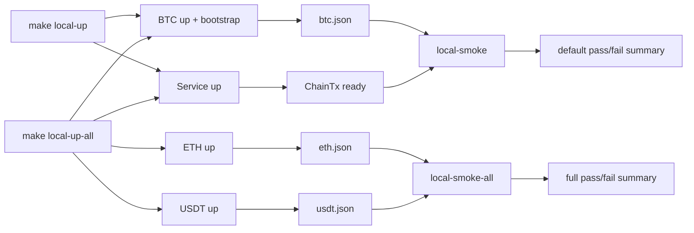

# Technical Design

## High-level approach

- Summary: Build a local integration harness around ChainTx using four compose units: service stack (app + postgres) and three rail stacks (btc, eth, usdt). Keep USDT in a separate compose file while wiring it to ETH RPC over a shared external docker network.
- Key decisions:
  - Local constants are fixed for this spec:
    - BTC local sim network: `regtest` only
    - EVM local chain id: `31337`
    - Local USDT token decimals: `6`
  - BTC image/runtime is pinned to `bitcoin/bitcoin:29.0` and bootstrap requires descriptor-wallet RPC behavior.
  - Default startup profile is `service + BTC`; full-stack startup is explicit opt-in (`local-up-all`).
  - Use isolated compose files per rail with one shared external network (`chaintx-local-net`).
  - Use script-driven bootstrap/deploy jobs to generate deterministic artifacts.
  - BTC receiver key export is descriptor-based, account-level BIP84 (`wpkh`), external branch `/0/*`.
  - Keep ChainTx core business logic untouched unless minimal config plumbing is strictly required.
  - Standardize orchestration through Make targets including status and reset commands.

## System context

- Components:
  - `deployments/local-chains/docker-compose.btc.yml`
    - `btc-node` (`bitcoin/bitcoin:29.0`, regtest, descriptor wallet support)
    - `btc-bootstrap` (wallet creation/funding/descriptor+xpub export job)
  - `deployments/local-chains/docker-compose.eth.yml`
    - `eth-node` (local EVM JSON-RPC, deterministic accounts, chain id `31337`)
  - `deployments/local-chains/docker-compose.usdt.yml`
    - `usdt-deployer` (ERC20 deploy + mint job against `eth-node` RPC)
  - `deployments/local-chains/docker-compose.service.yml` (or local override of existing compose)
    - `postgres`
    - `app`
  - `scripts/local-chains/`
    - `btc_bootstrap.sh`
    - `eth_export_artifacts.sh`
    - `usdt_deploy.sh`
    - `smoke_local.sh`
    - `smoke_local_all.sh`
    - `status_local.sh`
- Interfaces:
  - Compose network contract:
    - every compose file joins `chaintx-local-net` with `external: true`
    - Make is responsible for creating/verifying this network before `up`
  - Compose project naming contract:
    - Make wrappers call `docker compose --project-name ...` with fixed values:
      - `chaintx-local-btc`
      - `chaintx-local-eth`
      - `chaintx-local-usdt`
      - `chaintx-local-service`
    - Artifact `compose_project` must equal the wrapper's exact project name.
  - Cross-compose addressing contract:
    - ETH RPC endpoint for USDT deployer defaults to `http://eth-node:8545`
    - stable aliases/service names are required for cross-compose communication
  - Artifact contract:
    - files under `deployments/local-chains/artifacts/`
    - required base fields: `schema_version`, `generated_at`, `network`, `compose_project`, `warnings`

## Key flows

- Flow 1: Bring up default local profile (resource-light)

  - `make local-up` sequence:
    1. create/verify `chaintx-local-net`
    2. `make chain-up-btc`
    3. wait BTC readiness + run BTC bootstrap
    4. `make service-up`
    5. print `local-status`

- Flow 1b: Bring up optional full profile

  - `make local-up-all` sequence:
    1. create/verify `chaintx-local-net`
    2. `make chain-up-btc`
    3. wait BTC readiness + run BTC bootstrap
    4. `make chain-up-eth`
    5. wait ETH readiness (`eth_chainId == 31337`)
    6. `make chain-up-usdt`
    7. `make service-up`
    8. print `local-status`

- Flow 2: BTC bootstrap (descriptor-based)

  - Wait BTC RPC readiness (`getblockchaininfo`, `initialblockdownload=false`).
  - Create/reuse payer and receiver wallets using `createwallet` with `descriptors=true` (legacy-wallet mode is disallowed in this feature).
  - Ensure payer has spendable funds (mine top-up blocks; satisfy coinbase maturity).
  - Extract receiver descriptor using `listdescriptors`-compatible RPC.
  - Parse and store:
    - `receiver_descriptor` (`wpkh([... ]tpub.../0/*)#checksum`)
    - `receiver_xpub`
    - `derivation_template` (`m/84'/1'/0'/0/{index}`)
  - Write `btc.json` artifact with schema metadata.

- Flow 3: ETH + USDT bootstrap

  - ETH stack starts local chain and exports `eth.json` (`chain_id=31337`, funded account info).
  - USDT deployer preflight checks:
    - ETH RPC reachable
    - `eth_chainId == 31337`
  - USDT deterministic deployment policy:
    - if `usdt.json` exists and fingerprint matches current ETH chain (`chain_id + genesis_block_hash`), skip redeploy and reuse artifact
    - if fingerprint mismatches, fail with remediation (`local-reset-usdt` then `chain-up-usdt`)
  - Deploy ERC20 with `decimals=6`, mint test balance, write `usdt.json` when deployment is required.

- Flow 4: Smoke checks

  - `make local-smoke` validates default profile:
    - service `GET /healthz`
    - BTC send + mine + confirmation evidence
  - `make local-smoke-all` validates full profile:
    - default checks
    - ETH transfer capability
    - USDT balance/transfer checks
  - Stale-state guard:
    - if ETH state changes and `usdt.json` no longer matches deployed chain state, fail fast with reset instruction.

- Flow 5: Reset strategy
  - `local-reset-btc`: remove BTC volumes/state and `btc.json`
  - `local-reset-eth`: remove ETH volumes/state and `eth.json`
  - `local-reset-usdt`: remove USDT deployment cache/state and `usdt.json`
  - `local-reset-all`: run all resets and clear composite status cache

## Diagrams (optional)



## Data model

- Entities:
  - `deployments/local-chains/artifacts/btc.json`
    - `schema_version`, `generated_at`, `network`, `compose_project`, `warnings`
    - `rpc_url`, `payer_wallet`, `payer_address`
    - `receiver_wallet`, `receiver_descriptor`, `receiver_xpub`, `derivation_template`
  - `deployments/local-chains/artifacts/eth.json`
    - `schema_version`, `generated_at`, `network`, `compose_project`, `warnings`
    - `rpc_url`, `chain_id`, `genesis_block_hash`, `payer_address`, `payer_private_key`
  - `deployments/local-chains/artifacts/usdt.json`
    - `schema_version`, `generated_at`, `network`, `compose_project`, `warnings`
    - `rpc_url`, `chain_id`, `genesis_block_hash`, `contract_address`, `token_decimals`, `minted_to`, `minted_amount`
- Schema changes or migrations:
  - No new application DB schema required by this spec.
- Consistency and idempotency:
  - Bootstrap/deploy scripts are rerunnable and deterministic.
  - Artifact consumers fail fast on missing required fields.
  - Stale artifact detection is mandatory before full smoke operations.
  - `compose_project` in artifacts is deterministic and sourced from fixed Make wrapper project names.

## API or contracts

- Endpoints or events:
  - No new public ChainTx endpoints are introduced.
- Local CLI contract:
  - Per-rail lifecycle: `chain-up-*`, `chain-down-*`, `chain-logs-*`, `chain-ps-*`
  - Profiles: `local-up`, `local-up-all`, `local-down`
  - Smoke: `local-smoke`, `local-smoke-all`
  - Reset: `local-reset-btc`, `local-reset-eth`, `local-reset-usdt`, `local-reset-all`
  - Status: `local-status`
- Request/response examples:

```json
{
  "schema_version": 1,
  "generated_at": "2026-02-12T12:00:00Z",
  "network": "regtest",
  "compose_project": "chaintx-local-btc",
  "warnings": [],
  "receiver_descriptor": "wpkh([abcd1234/84'/1'/0']tpub.../0/*)#xyz",
  "receiver_xpub": "tpubD6Nz...",
  "derivation_template": "m/84'/1'/0'/0/{index}"
}
```

## Backward compatibility (optional)

- API compatibility: Existing service APIs remain unchanged.
- Data migration compatibility: Existing PostgreSQL schema/migrations remain unchanged by this spec.

## Failure modes and resiliency

- Retries/timeouts:
  - Bootstrap/deploy jobs use bounded retry loops waiting for RPC readiness.
  - Fail fast with explicit exit code and message when retry limit is exceeded.
- Backpressure/limits:
  - Default profile avoids ETH+USDT startup to reduce host pressure.
  - Optional full profile is explicit and can include resource limits in compose.
- Degradation strategy:
  - If one rail fails, restart only that rail.
  - `local-up` / `local-up-all` stop on first critical failure and print remediation.
  - Stale artifact mismatch reports targeted reset command.

## Observability

- Logs:
  - Rail-specific logs via Make wrappers.
  - Structured bootstrap/deploy/smoke summaries with artifact paths.
- Metrics:
  - Not mandatory for first iteration; smoke summary JSON is required.
- Traces:
  - Not required for infra bootstrap scripts.
- Alerts:
  - Not required; local workflow only.

## Security

- Authentication/authorization:
  - Local-only environment; no external auth integration required.
- Secrets:
  - Test keys only.
  - Generated artifacts/keys stay in git-ignored paths.
  - Docs explicitly warn against reusing local keys on real networks.
- Abuse cases:
  - USDT deploy pointed to wrong network.
  - Mitigation: strict `chain_id=31337` preflight gate before deployment/mint.

## Alternatives considered

- Option A: One monolithic compose file for all chains and service.
  - Rejected: conflicts with rail-level isolation and profile-based resource control.
- Option B: Mock chain behavior in tests only.
  - Rejected: does not validate real RPC, descriptor extraction, or contract deployment paths.
- Option C: Use external shared testnet only.
  - Rejected: unstable, slower, and less deterministic for local smoke workflows.

## Risks

- Risk: Bitcoin Core descriptor behavior differs by image version.
- Mitigation: pin `bitcoin/bitcoin:29.0`, enforce descriptor wallet creation (`descriptors=true`), and verify `listdescriptors` flow in smoke tests.

- Risk: Full profile overloads low-resource machines.
- Mitigation: keep minimal default profile and document full-profile usage as opt-in.

- Risk: ETH reset leaves stale USDT artifact, causing false smoke failures.
- Mitigation: stale-artifact detection + explicit reset commands in runbook.
