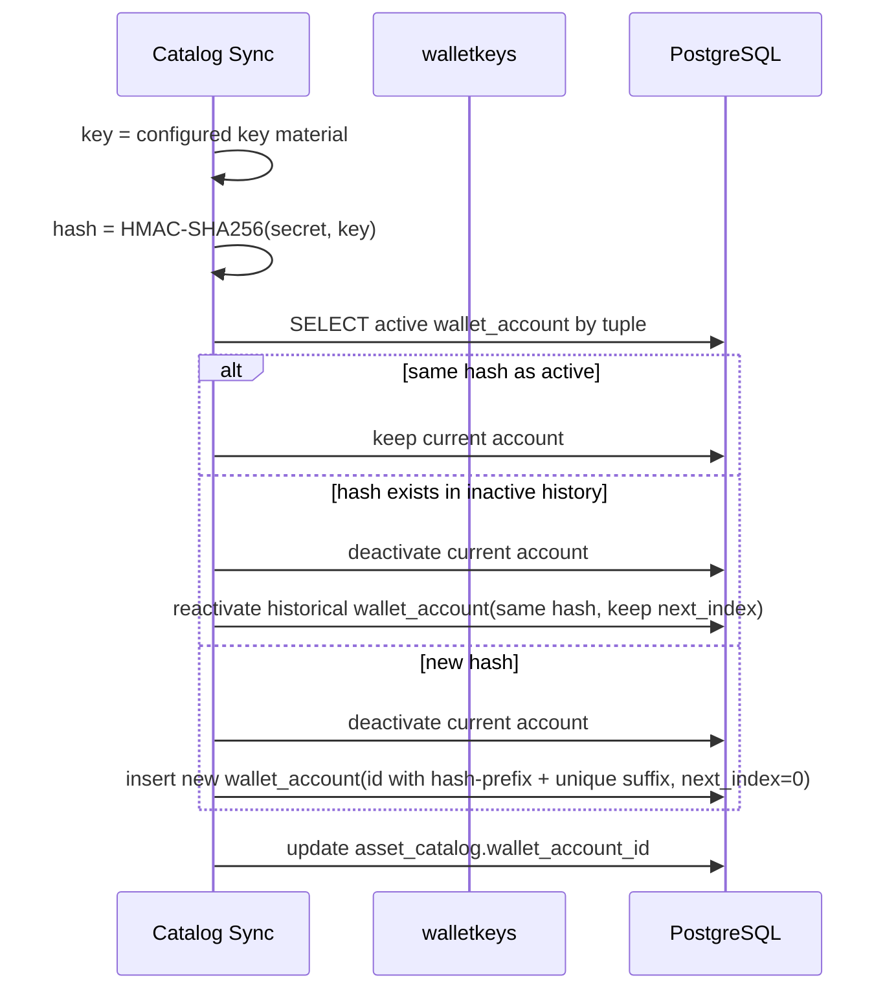

# Technical Design

## High-level approach

- Summary: Add a key-material identity layer based on configured key-material `hmac-sha256` hash. Use this hash to reuse active row, reactivate matching historical row, or rotate to a new wallet account id only when hash is unseen.
- Key decisions:
  - Keep raw xpub/tpub/vpub out of relational storage.
  - Compute hash from configured key-material string with `hmac-sha256`.
  - Use `hmac-sha256` with secret from `PAYMENT_REQUEST_KEYSET_HASH_HMAC_SECRET`.
  - Persist hash on `wallet_accounts` and manage one active row per `(chain, network, keyset_id)`.
  - Auto-generate `wallet_account_id` with chain/network/hash-prefix plus uniqueness suffix only when hash is unseen for the tuple.
  - Keep address verification command for index `0` as operator-facing safety check.
  - Add startup preflight script that runs `cmd/keysetverify` for configured keysets before `docker compose up ... app`.

## System context

- Components:
  - `internal/infrastructure/walletkeys`: parse/normalize/validate/derive.
  - `cmd/keysetverify`: deterministic index-0 verification command.
  - `scripts/local-chains/service_verify_keysets.sh`: startup preflight gate.
  - `scripts/local-chains/service_sync_catalog.sh`: startup catalog + wallet-account sync.
  - PostgreSQL tables: `app.wallet_accounts`, `app.asset_catalog`.
  - Optional verifier entrypoint (script/Go command) for ad-hoc user input validation.
- Interfaces:
  - Input: devtest keyset map from env (preferred nested `chain -> network -> {keyset_id, extended_public_key, expected_index0_address}`).
  - DB: wallet account upsert + asset catalog remap.
  - CLI output: `match`, `expected_address`, `derived_address`, `reason`.
  - Config compatibility: keyset env parser accepts legacy map formats and preferred nested `chain -> network -> {keyset_id, extended_public_key}` format.

## Key flows

- Flow 0: Deployment preflight verification gate
  - Resolve keysets JSON payload before startup.
  - For each configured keyset with expected index-0 address, execute `go run ./cmd/keysetverify` with chain/network/scheme/key/keyset_id/expected-address.
  - If any command returns non-zero, stop immediately and return non-zero from `service-up` (app container must not start).
  - If all pass, continue to service startup and catalog sync.
- Flow 1: Operator verification (index `0`)
  - Parse and normalize key by chain.
  - Validate account-level policy and template.
  - Derive index `0` address and compare to expected.
  - Return pass/fail with typed reason.
- Flow 2: Startup hash-based wallet-account rotation
  - Resolve keyset raw value from env map.
  - Compute `key_material_hash` from configured key-material string.
  - Query active wallet account by `(chain, network, keyset_id)`.
  - If active hash equals new hash: reuse account.
  - If hash differs and a historical inactive row with the same hash exists: mark current active row inactive, reactivate historical row, keep historical `next_index`.
  - If hash differs and no historical row with the same hash exists: create new `wallet_account_id`, set `next_index=0`.
  - Update `asset_catalog.wallet_account_id` to the resolved active account.
  - Commit in single transaction.

## Diagrams (optional)

- Mermaid sequence / flow:

## Data model

- Entities:
  - `wallet_accounts` gains key-material identity attributes.
  - `asset_catalog` remains mapping source and points to active wallet account id.
- Schema changes or migrations:
  - Add `key_material_hash` column (text/hex) to `app.wallet_accounts`.
  - Add `key_material_hash_algo` column (fixed `hmac-sha256`) to support explicit algorithm contract.
  - Replace current uniqueness (`chain, network, keyset_id`) with active-row uniqueness:
    - one active row per tuple via partial unique index on `(chain, network, keyset_id)` where `is_active=true`.
  - Keep historical inactive rows for audit/debug.
- Consistency and idempotency:
  - Rotation action must be transactionally atomic with catalog remap.
  - Re-running sync with unchanged hash must be no-op (reuse path).
  - Reverting to previously used hash must reactivate that hash's historical row and keep its existing `next_index`.
  - Generated id format: `wa_<chain>_<network>_<hash_prefix>_<random>_<timestamp>`.

## API or contracts

- Endpoints or events:
  - No public API contract changes required for this feature.
  - Internal sync contract adds hash-based decision result: `reused`, `reactivated`, or `rotated`.
- Request/response examples:
  - Keyset entry (preferred nested format):
    - `{ "keyset_id": "ks_eth_sepolia", "extended_public_key": "xpub...", "expected_index0_address": "0x..." }`
  - Verifier input (CLI args or JSON):
    - `chain=ethereum`
    - `network=sepolia`
    - `address_scheme=evm_bip44`
    - `keyset_id=ks_eth_sepolia`
    - `extended_public_key=<xpub...>`
    - `expected_address=0x...`
  - Verifier output:
    - `{ "match": true, "expected_address": "...", "derived_address": "...", "reason": "" }`

## Backward compatibility (optional)

- API compatibility:
  - Existing payment request API remains unchanged.
- Data migration compatibility:
  - Legacy rows without hash are backfilled at startup from configured keysets.
  - If keyset material is missing for required tuple, startup validation fails with explicit configuration error.

## Failure modes and resiliency

- Retries/timeouts:
  - Preflight verification executes once per configured keyset before startup; no retry loop.
  - Startup sync keeps existing retry behavior for DB readiness.
  - Rotation SQL executes once per tuple in a transaction; on conflict, transaction rolls back.
- Backpressure/limits:
  - Tuple count is small; sync runs bounded by enabled catalog rows.
- Degradation strategy:
  - On preflight mismatch/invalid keyset, abort startup before app container creation.
  - On hash computation or rotation failure, service startup should fail-fast (no partial active mapping).

## Observability

- Logs:
  - Preflight emits one line per keyset with `chain`, `network`, `keyset_id`, `result`.
  - Structured fields: `chain`, `network`, `keyset_id`, `action` (`reused|rotated`), `wallet_account_id`.
  - Do not log raw xpub; log only hash prefix.
- Metrics:
  - Counter `wallet_account_rotation_total{action=...}`.
  - Counter `wallet_account_rotation_error_total{reason=...}`.
- Traces:
  - Optional startup span around sync transaction.
- Alerts:
  - Alert on repeated startup failures caused by hash/rotation validation errors.

## Security

- Authentication/authorization:
  - Unchanged for external API; verification utility is operator-local.
- Secrets:
  - Raw xpub comes from env/operator input and must not be persisted to DB.
  - HMAC key is mandatory in runtime env as `PAYMENT_REQUEST_KEYSET_HASH_HMAC_SECRET`.
- Abuse cases:
  - Prevent accidental disclosure by masking key material in logs and errors.
  - Reject oversized/invalid key strings early to avoid parser abuse.

## Alternatives considered

- Option A: Keep current behavior and manually reset `next_index` on xpub change.
- Option B: Store raw xpub in DB and compare directly.
- Why chosen:
  - Option A is operationally fragile and easy to misuse.
  - Option B violates privacy requirement.
  - Chosen approach gives deterministic automation while keeping raw key material out of DB.

## Risks

- Risk: Reverting to old key hash can reset address cursor if system always inserts new row.
- Mitigation: Reactivate historical row for matching hash and preserve `next_index`.

- Risk: Hash collision (extremely low probability) could map different keys to same identity.
- Mitigation: Use SHA-256 full digest for equality checks; hash prefix only for id readability, not equality logic.

- Risk: Migration from old unique constraint may break existing upsert logic if not updated together.
- Mitigation: Ship migration + sync logic update + integration tests in one release unit.
