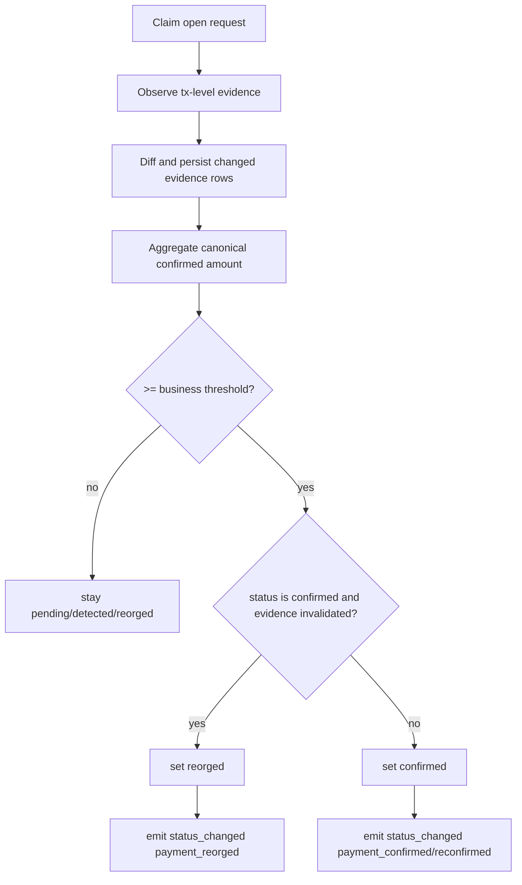

# Technical Design

## High-level approach

- Summary: introduce a tx-level settlement-evidence model and a reversible
  lifecycle state (`reorged`) so reconciler can rollback and later recover
  confirmation decisions based on canonical chain view.
- Key decisions:
  - Keep current polling reconciler architecture and lease model.
  - Add evidence persistence in outbound PostgreSQL adapter.
  - Keep webhook event type unchanged; extend payload fields additively.
  - Use dual confirmation thresholds (`business`, `finality`) plus explicit reorg observe window.
  - Remove aggregate/snapshot settlement labels as primary evidence and emit
    chain-native installment items for BTC/ETH/ERC20.

## System context

- Components:
  - `internal/domain/value_objects`: extend `PaymentRequestStatus` with `reorged`.
  - `internal/application/use_cases/reconcile_payment_requests_use_case.go`:
    move from direct boolean-only observer output to evidence-aware decision
    engine.
  - `internal/application/ports/out/payment_chain_observer_gateway.go`:
    extend output contract to return settlement evidence list and chain
    canonicality hints.
  - `internal/adapters/outbound/chainobserver/devtest/*`: produce per-rail
    installment evidence (BTC outpoints; ETH tx hash; ERC20 tx hash + log
    index).
  - `internal/adapters/outbound/persistence/postgresql/paymentrequest/*`:
    add evidence table repository operations and query adjustments for
    active-monitoring horizon.
- Interfaces:
  - inbound unchanged (existing reconciler worker invokes same use case entrypoint).
  - outbound port additions are additive and implemented by existing adapters.

## Key flows

- Flow 1: normal confirmation

  - claim request
  - observe chain evidence
  - diff observed evidence against stored evidence and persist only new/changed entries
  - aggregate canonical amount from installment evidence items
  - if stability threshold satisfied at business confirmations:
    `pending/detected/reorged -> confirmed`
  - persist `first_confirmed_at` (in metadata) and emit webhook with `transition_reason`.

- Flow 2: reorg rollback

  - claim previously confirmed request still inside active monitoring policy
  - observe evidence where tracked canonical entries become orphaned or below threshold
  - if orphan explicit: immediate `confirmed -> reorged`; else require stability cycles
  - emit webhook with `transition_reason=payment_reorged`.

- Flow 3: re-confirm after reorg
  - continue polling `reorged` request
  - new canonical evidence appears and reaches business threshold
  - transition `reorged -> confirmed` (`transition_reason=payment_reconfirmed`)
  - maintain/update finality tracking and monitoring horizon.

## Diagrams (optional)

- Mermaid sequence / flow:

## Data model

- Entities:
  - `payment_request` (existing) adds logical lifecycle path with `reorged`.
  - `payment_request_settlements` (new): settlement evidence ledger per request.
- Schema changes or migrations:
  - Migration A: extend `payment_requests.status` constraint to include `reorged`.
  - Migration B: create `app.payment_request_settlements` with fields:
    - `payment_request_id` (FK)
    - `evidence_ref` (chain-specific unique installment reference)
    - `amount_minor` (`numeric(78,0)`)
    - `block_height`, `block_hash`
    - `confirmations`
    - `is_canonical` boolean
    - `first_seen_at`, `last_seen_at`, `updated_at`
    - optional `metadata` jsonb
  - Migration C: composite primary key on `(payment_request_id, evidence_ref)`
    plus index on `(payment_request_id, is_canonical, confirmations)`.
- Consistency and idempotency:
  - per-cycle observer data is keyed by `payment_request_id + evidence_ref`;
    unchanged evidence does not trigger DB row writes.
  - repeated cycles produce same canonical totals.
  - transition write remains compare-and-set (`TransitionStatusIfCurrent`) guarded by lease ownership.
  - split payments persist as multiple evidence rows for a single payment request.

## API or contracts

- Endpoints or events:
  - No new HTTP endpoint.
  - Existing `payment_request.status_changed` webhook payload adds:
    - `transition_reason` (string)
    - `finality_reached` (bool)
    - `evidence_summary` object (`canonical_count`, `canonical_amount_minor`, `orphaned_count`).
- Request/response examples:
  - `transition_reason=payment_reorged` when `confirmed -> reorged`.
  - `transition_reason=payment_reconfirmed` when `reorged -> confirmed`.

## Backward compatibility (optional)

- API compatibility: status field is open string; adding `reorged` is
  compatible with existing schema contract.
- Data migration compatibility: additive table + status constraint update, idempotent migrations required.

## Failure modes and resiliency

- Retries/timeouts:
  - observer endpoint timeout keeps current row unchanged and increments cycle error count.
  - evidence persistence failures fail cycle with typed app error.
- Backpressure/limits:
  - per-request evidence write volume is bounded by observer-reported
    installment count, batch size, and evidence delta size.
  - stale confirmed requests beyond monitoring horizon are excluded from active polling.
  - EVM block/log scanning in devtest mode reads full canonical history for
    correctness and can be replaced by indexed adapters in other deployment
    modes.
- Degradation strategy:
  - if evidence details unavailable for a rail, adapter returns structured unsupported/error; request remains in previous state.

## Observability

- Logs:
  - transition logs include reason + confirmation/finality metadata.
  - cycle summary includes counts for `reorged`, `reconfirmed`, and orphan detections.
- Metrics:
  - counters: `reconcile_reorged_total`, `reconcile_reconfirmed_total`.
  - gauge: `reconcile_active_confirmed_monitoring_count`.
- Traces:
  - deferred in this iteration.
- Alerts:
  - startup config validation failures remain fail-fast; optional thresholding over reorg counters documented.

## Security

- Authentication/authorization: unchanged.
- Secrets: no new secret classes; existing HMAC/admin key behavior unchanged.
- Abuse cases:
  - malformed observer payload cannot directly set terminal status without validation and CAS transition.

## Alternatives considered

- Option A: keep balance-only observer and increase min confirmations.
- Option B: tx-level evidence with reversible status (chosen).
- Why chosen: only Option B can explain and deterministically reverse false confirmation under canonical-chain changes.

## Risks

- Risk: evidence table growth over time.
- Mitigation: define retention/archival follow-up after stabilization.
- Risk: observer contract expansion increases adapter complexity.
- Mitigation: keep rail-specific parser modules and focused integration tests.
