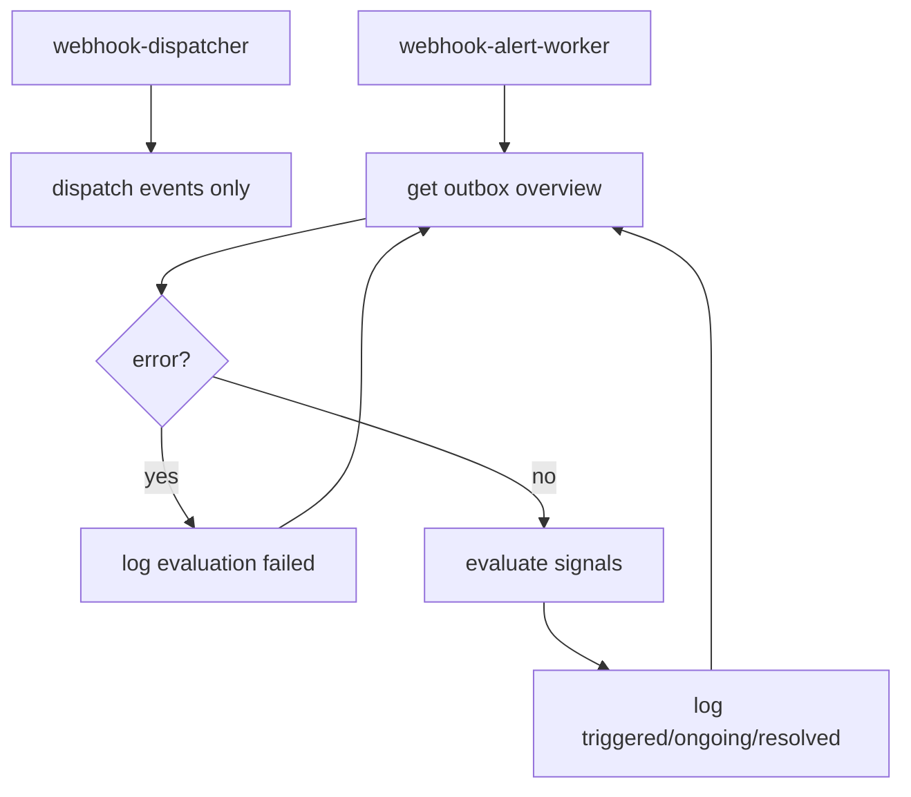

# Technical Design

## High-level approach

- Summary: use dedicated runtime split for alerting.
  - `webhook-dispatcher`: delivery only.
  - `webhook-alert-worker`: threshold polling + alert lifecycle logs.
- Key decisions:
  - alert evaluation moved from dispatcher into `internal/infrastructure/webhookalert`.
  - reuse `GetWebhookOutboxOverviewUseCase` for alert snapshot source.
  - keep in-memory per-signal lifecycle state with cooldown.

## System context

- Components:
  - `cmd/webhook-alert-worker`: startup + config validation + loop lifecycle.
  - `internal/infrastructure/webhookalert/worker.go`: polling loop.
  - `internal/infrastructure/webhookalert/alert_monitor.go`: signal state machine.
  - `internal/infrastructure/webhook/worker.go`: dispatch-only worker.
  - `internal/infrastructure/di/container.go`: separate builder for alert runtime.
- Interfaces:
  - `portsin.GetWebhookOutboxOverviewUseCase`
  - `portsin.DispatchWebhookEventsUseCase`

## Key flows

- Flow 1: alert runtime startup

  - load config.
  - validate `PAYMENT_REQUEST_WEBHOOK_ALERT_ENABLED=true` for alert runtime.
  - init persistence and start poll loop.

- Flow 2: alert poll cycle

  - query outbox overview.
  - evaluate enabled signals (`failed_count`, `pending_ready_count`, `oldest_pending_age_seconds`).
  - emit `triggered/ongoing/resolved` logs with cooldown gating.

- Flow 3: failure isolation

  - query error -> log `webhook alert evaluation failed`.
  - continue next cycle.

- Flow 4: dispatch cycle
  - dispatcher runs delivery flow only, no alert query/evaluation branch.

## Diagrams (optional)

## Data model

- Entities:
  - no domain/entity/schema change.
  - alert worker keeps in-memory state map by signal.
- Schema changes or migrations:
  - none.
- Consistency and idempotency:
  - lifecycle state is per-process and non-durable.

## API or contracts

- Endpoints or events:
  - no HTTP API changes.
  - log contract:
    - `webhook alert triggered ...`
    - `webhook alert ongoing ...`
    - `webhook alert resolved ...`
- Request/response examples:
  - N/A.

## Backward compatibility (optional)

- API compatibility: unchanged.
- Data migration compatibility: unchanged.

## Failure modes and resiliency

- Retries/timeouts:
  - no internal retry loop; rely on next poll cycle.
- Backpressure/limits:
  - one overview query per poll interval.
- Degradation strategy:
  - alert errors logged without stopping runtime.

## Observability

- Logs:
  - alert logs originate from `webhook-alert-worker` only.
  - dispatcher logs remain delivery-centric.
- Metrics:
  - no external metrics system introduced.
- Traces:
  - none.
- Alerts:
  - threshold-driven lifecycle logs.

## Security

- Authentication/authorization:
  - no new inbound endpoints.
- Secrets:
  - do not log secrets/payload.
- Abuse cases:
  - no new external attack surface.

## Alternatives considered

- Option A: keep alert in dispatcher with distributed lock.
  - Pros: fewer binaries.
  - Cons: coupling and config ambiguity remain.
- Option B: dedicated runtime (chosen).
  - Pros: clear responsibility and operational clarity.
  - Cons: extra container to manage.

## Risks

- Risk: alert worker scaled >1 causing duplicate signals.
- Mitigation: default replica=1 and docs guidance.

- Risk: deployment forgets alert profile.
- Mitigation: compose + Makefile wiring + README examples.
