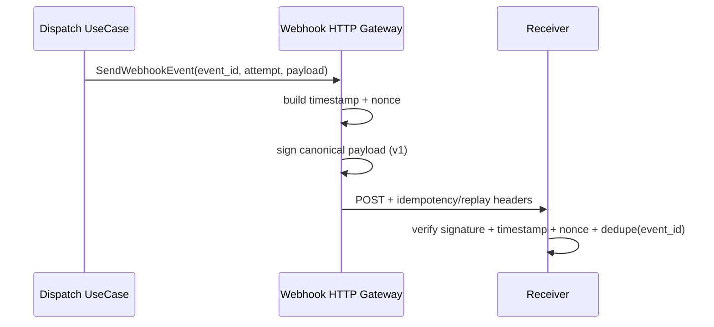

# Technical Design

## High-level approach

- Summary: extend webhook send contract with explicit idempotency header mapping and versioned anti-replay signature headers while preserving legacy signature header.
- Key decisions:
  - add 1-based delivery attempt to `SendWebhookEventInput` so gateway can emit `X-ChainTx-Delivery-Attempt`.
  - emit `Idempotency-Key = event_id` and keep `X-ChainTx-Event-Id` for compatibility.
  - emit new anti-replay headers: `X-ChainTx-Nonce`, `X-ChainTx-Signature-Version`, `X-ChainTx-Signature-V1`.
  - keep legacy `X-ChainTx-Signature` in current format during migration window.

## System context

- Components:
  - `DispatchWebhookEventsUseCase` (provides event identity and attempt count per delivery attempt).
  - `WebhookEventGateway` HTTP adapter (builds headers and signatures).
  - Receiver systems (verify signature and enforce idempotency/replay policy).
- Interfaces:
  - `dto.SendWebhookEventInput` gains `DeliveryAttempt int`.

## Key flows

- Flow 1: successful send
  - use case claims row and computes delivery attempt (`attempts + 1`).
  - gateway creates timestamp + nonce.
  - gateway signs canonical payload and sets both legacy and v1 signature headers.
  - request returns 2xx and use case marks delivered.
- Flow 2: retry send
  - same `event_id` reused, `DeliveryAttempt` increases.
  - fresh nonce/timestamp/signature emitted per retry.

## Diagrams (optional)

## Data model

- Entities: no new domain entities.
- Schema changes or migrations: none.
- Consistency and idempotency:
  - event id remains stable at outbox row level.
  - retries keep same event id, with increasing attempt number.

## API or contracts

- Endpoints or events: no API route changes; outbound webhook header contract extended.
- Request/response examples:
  - headers:
    - `X-ChainTx-Event-Id: evt_...`
    - `Idempotency-Key: evt_...`
    - `X-ChainTx-Delivery-Attempt: 1`
    - `X-ChainTx-Timestamp: <unix-seconds>`
    - `X-ChainTx-Nonce: <random-hex>`
    - `X-ChainTx-Signature-Version: v1`
    - `X-ChainTx-Signature-V1: sha256=<hex>`
    - `X-ChainTx-Signature: sha256=<legacy-hex>`
  - canonical payload v1:
    - `<timestamp>.<nonce>.<event_id>.<event_type>.<body>`

## Backward compatibility (optional)

- API compatibility: outbound headers are additive, except receiver migration to use `X-ChainTx-Signature-V1` for replay defense.
- Data migration compatibility: no persistence migration.

## Failure modes and resiliency

- Retries/timeouts: unchanged dispatcher retry semantics.
- Backpressure/limits: negligible overhead from nonce generation + extra HMAC.
- Degradation strategy: if v1 header generation fails (unexpected), request send fails and existing retry path handles it.

## Observability

- Logs: existing dispatch cycle logs unchanged; attempt/event id available in receiver logs via headers.
- Metrics: no new metrics in this iteration.
- Traces: deferred.
- Alerts: deferred.

## Security

- Authentication/authorization: unchanged.
- Secrets: `PAYMENT_REQUEST_WEBHOOK_HMAC_SECRET` remains required; secret never logged.
- Abuse cases:
  - replayed captured request should be rejected by receiver nonce cache + timestamp window when receiver adopts v1 contract.

## Alternatives considered

- Option A: replace existing signature header formula directly (breaking).
- Option B: dual-header rollout (legacy + v1 anti-replay signature).
- Why chosen: Option B enables safer migration while providing immediate receiver upgrade path.

## Risks

- Risk: receivers keep verifying only legacy signature and skip replay checks.
- Mitigation: explicit README contract promoting v1 verification as required security path.
