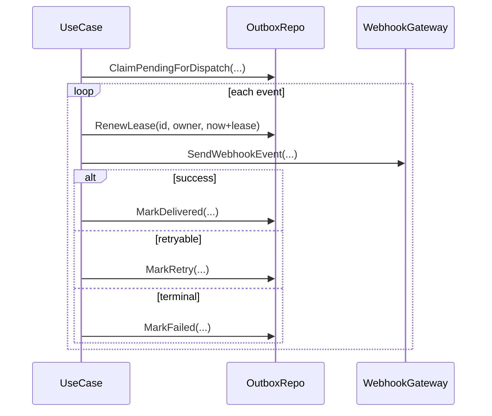

# Technical Design

## High-level approach

- Summary: add per-event heartbeat renewal loop during delivery attempts and stop it after final mark update.
- Key decisions:
  - extend outbound repository port with `RenewLease(...)` operation.
  - keep heartbeat scheduling in application use case (business orchestration layer), SQL renewal in outbound adapter.
  - derive heartbeat interval from lease duration (`lease/3`, floor to at least 100ms, always `< lease_duration`).

## System context

- Components:
  - `DispatchWebhookEventsUseCase` (orchestrates claim/send/retry/heartbeat lifecycle).
  - `WebhookOutboxRepository` (claim/mark/renew lease).
  - `Webhook Worker` (poll loop unchanged).
- Interfaces:
  - new repository method: renew claimed row lease with ownership guard.

## Key flows

- Flow 1: normal success path
  - claim pending rows
  - for each row start heartbeat ticker context
  - send webhook HTTP request
  - mark delivered
  - stop heartbeat goroutine
- Flow 2: retry/failure path
  - heartbeat runs during HTTP attempt
  - on send error -> mark retry or failed
  - stop heartbeat goroutine
- Flow 3: ownership lost/renewal failure
  - renewal returns false or error
  - heartbeat loop stops
  - use case continues with current attempt and existing mark semantics

## Diagrams (optional)

## Data model

- Entities:
  - existing `app.webhook_outbox_events` row fields reused (`lease_owner`, `lease_until`, `delivery_status`).
- Schema changes or migrations:
  - none required.
- Consistency and idempotency:
  - claim still uses row lock + lease columns.
  - renewal is compare-and-owner guarded update.
  - system remains at-least-once.

## API or contracts

- Endpoints or events:
  - no HTTP API contract changes.
- Request/response examples:
  - repository contract addition:
    - `RenewLease(ctx, id, leaseOwner, leaseUntil, updatedAt) (bool, *AppError)`

## Backward compatibility (optional)

- API compatibility: unchanged external API.
- Data migration compatibility: no migration.

## Failure modes and resiliency

- Retries/timeouts:
  - existing retry/backoff unchanged.
  - heartbeat interval < lease duration to avoid expiration during slow send.
- Backpressure/limits:
  - one lightweight heartbeat goroutine per in-flight event only during active send.
- Degradation strategy:
  - if renewal fails, continue existing mark logic and rely on lease expiry recovery model.

## Observability

- Logs:
  - renewal failure: event id, worker id, app error code.
  - optional debug-level renewal success can remain omitted to avoid log noise.
- Metrics:
  - deferred in this iteration.
- Traces:
  - deferred.
- Alerts:
  - deferred (log-based alert can be added later).

## Security

- Authentication/authorization: unchanged.
- Secrets: unchanged HMAC handling.
- Abuse cases:
  - no new external input surface.

## Alternatives considered

- Option A: no heartbeat, increase lease duration globally.
- Option B: heartbeat renewal per in-flight event.
- Why chosen: Option B handles variable latency without forcing large lease (which would slow crash recovery).

## Risks

- Risk: renewal goroutine leaks on early returns.
- Mitigation: explicit cancellation + wait (`stopHeartbeat(); <-heartbeatDoneCh`) in per-event processing.
- Risk: excessive DB writes with very short leases.
- Mitigation: derived interval and validation guard.
