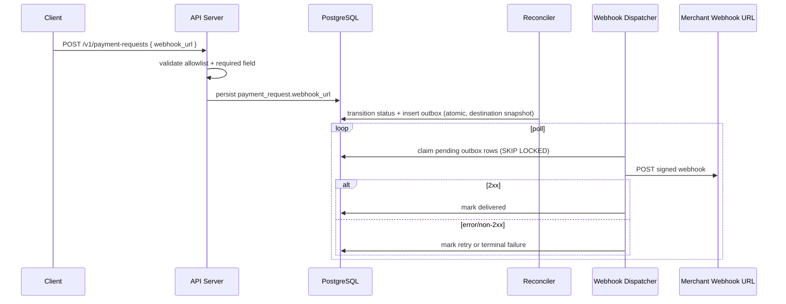

# Technical Design

## High-level approach

- Summary: keep DB-backed outbox delivery architecture, but shift destination selection to per-payment-request `webhook_url` (mandatory input) and enforce allowlist at creation time.
- Key decisions:
  - persist outbox rows atomically in the same SQL transition operation for reconciler status changes.
  - run webhook dispatch in dedicated `cmd/webhook-dispatcher` runtime/container.
  - use at-least-once delivery with event id and configurable max attempts.
  - use HMAC-SHA256 signature headers with timestamp for receiver verification.
  - destination URL comes from payment request/outbox record, not global runtime URL env.

## System context

- Components:
  - payment request creation use case + repository (validate required `webhook_url` and allowlist).
  - reconciliation repository adapter (status transition + outbox enqueue).
  - `dispatchWebhookEventsUseCase`.
  - webhook HTTP outbound gateway (sign + POST).
  - webhook dispatcher worker in infrastructure.
- Runtime boundaries:
  - `cmd/server`: API + optional in-process reconciler only.
  - `cmd/reconciler`: reconciler only.
  - `cmd/webhook-dispatcher`: webhook dispatcher only.

## Key flows

- Flow 1: payment request creation with destination binding
  - client calls `POST /v1/payment-requests` with required `webhook_url`.
  - inbound/application validate URL format and host allowlist.
  - repository persists canonical `webhook_url` on payment request row.
- Flow 2: status transition enqueue
  - reconciler evaluates target status.
  - repository executes transition-if-current SQL.
  - on successful transition, SQL inserts outbox row in same statement/transaction and snapshots destination URL from payment request.
- Flow 3: asynchronous dispatch
  - webhook worker polls by interval.
  - claims eligible rows (`pending`, `next_attempt_at <= now`) with SKIP LOCKED semantics.
  - POST signed payload to event-bound destination URL.
  - success -> mark delivered.
  - failure -> retry schedule with bounded exponential backoff, or terminal failure at max attempts.

## Diagrams (optional)

## Data model

- Schema changes:
  - `app.payment_requests`: add `webhook_url` (legacy rows may remain null; API requires non-empty for all new writes).
  - `app.webhook_outbox_events`: add `destination_url` snapshot column for dispatch-time independence.
  - indexes:
    - existing claim index retained.
    - optional index by `destination_url`/`payment_request_id` for troubleshooting.
- Consistency and idempotency:
  - enqueue is atomic with status transition write.
  - delivery is at-least-once; event id is stable and exposed to receiver.
  - claim query prevents duplicate claim in same cycle across workers.

## API or contracts

- Inbound API:
  - `POST /v1/payment-requests` adds required `webhook_url` field.
  - validation errors:
    - missing `webhook_url` -> explicit validation code.
    - allowlist mismatch -> explicit validation code.
- Outbound webhook:
  - event type: `payment_request.status_changed`.
  - headers:
    - `X-ChainTx-Event-Id`
    - `X-ChainTx-Event-Type`
    - `X-ChainTx-Timestamp`
    - `X-ChainTx-Signature` (`sha256=<hex>`)

## Failure modes and resiliency

- Retries/timeouts:
  - configurable HTTP timeout.
  - retry on transport error or non-2xx.
  - exponential backoff with configurable initial/max bounds.
- Degradation:
  - webhook disabled by config leaves status reconciliation unaffected.
  - destination validation failures block creation early (no invalid outbox destination later).
  - terminal failures remain queryable in outbox table.

## Observability

- Logs:
  - creation-time validation failures (`webhook_url` required/allowlist mismatch).
  - dispatcher cycle summary (claimed/sent/retried/failed/errors/latency).
  - dispatcher startup config validation failures.
- Metrics/traces:
  - deferred (existing behavior).

## Security

- SSRF controls:
  - enforce allowlist for request-level destination hosts.
  - enforce `http`/`https` scheme only; reject all other schemes.
- Secrets:
  - HMAC secret loaded from env; never logged.

## Alternatives considered

- Option A: keep single global webhook URL env.
- Option B: require per-request webhook URL with allowlist.
- Why chosen: aligns with manual payment flow requirements and reduces operational coupling between merchants/endpoints.

## Risks

- Risk: migration/backfill complexity for legacy payment requests lacking `webhook_url`.
- Mitigation: define explicit migration strategy and reject dispatch for legacy rows without destination until remediated.
